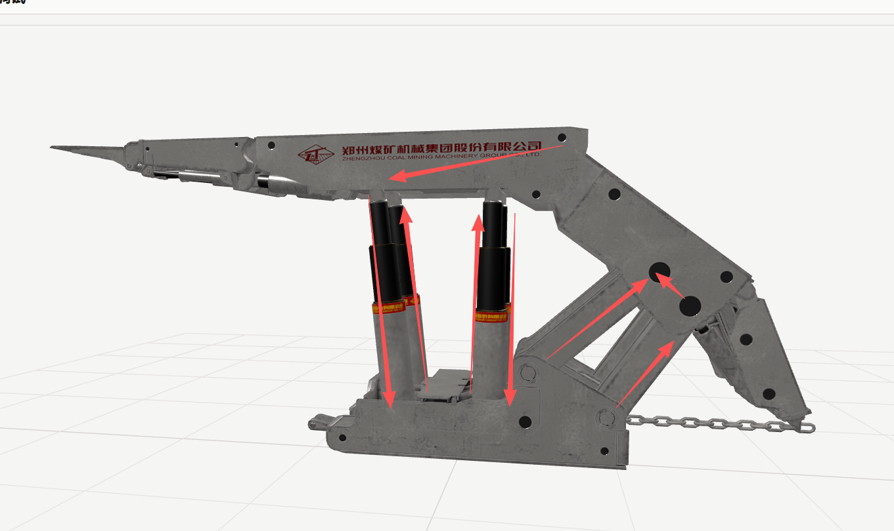
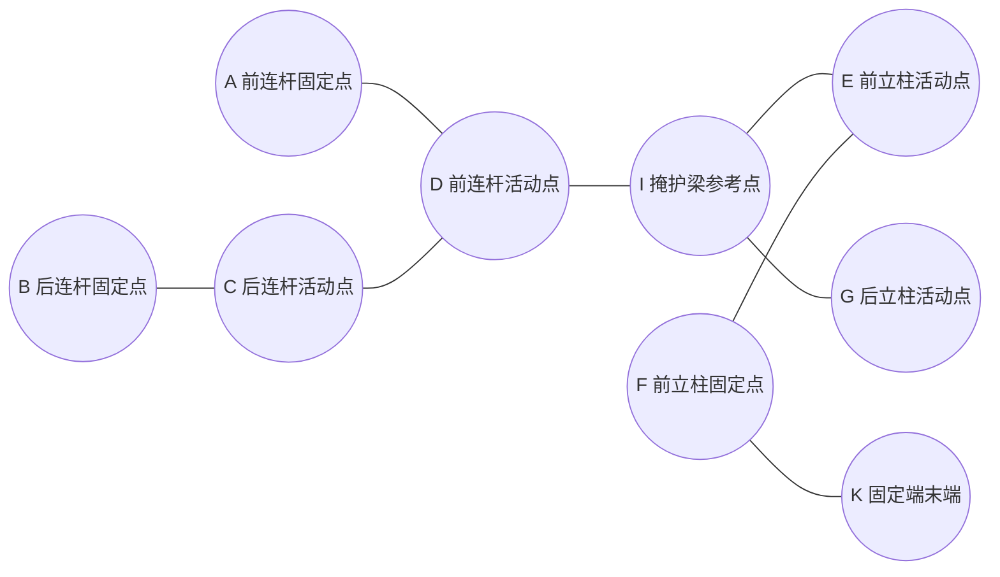
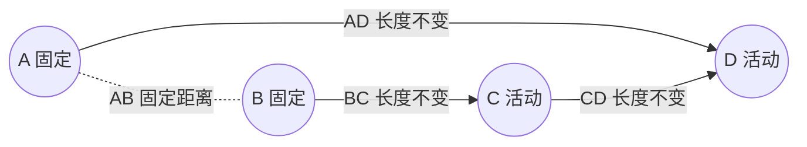
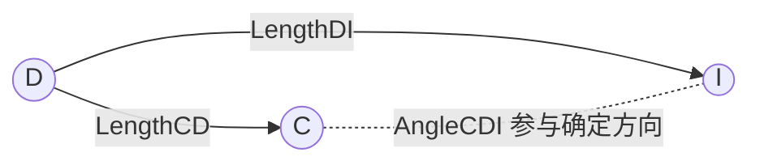
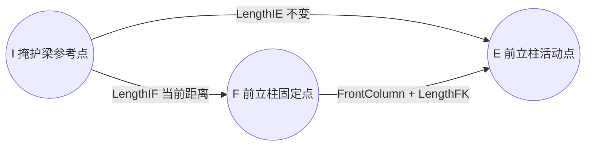
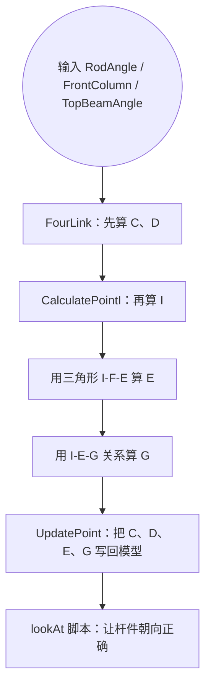

# ZF18000 液压机构算法讲解

这份文档用比较直白的方式讲解 `script/isRun/runFunction.js` 里的算法。可以先把它理解成一套带钉子的机械积木：

- 有些点是固定钉子。
- 有些点是活动钉子。
- 杆子的长度不能变。
- 代码每次都在算：活动钉子应该跑到哪里，模型部件就跟着跑到哪里。

下面这张图是项目里现有的机构示意图：



## 点位先认清

`runFunction.js` 里用到 9 个关键点：



可以这样记：

```text
A、B：固定在底座上的两个点
C、D：两根连杆上会动的点
I：掩护梁或顶梁上的参考点
E：前立柱顶部会动的点
G：后立柱顶部会动的点
F、K：前立柱固定端上的点
```

在项目里，很多运动点会使用 `<mesh名称>_pos` 这样的 Object3D。它们相当于给 mesh 外面加了一个方便控制的空节点。移动 `_pos`，就能带着对应 mesh 一起动。

## RockPoint：像用圆规画点

`RockPoint` 是最基础的函数。

它做的事情是：

```text
从 A 看向 B，得到一个方向。
把这个方向绕 X 轴转一个角度。
再从 A 出发，按指定长度画出去。
最后得到新点。
```

可以想成这样：

```text
        C 新位置
       /
      /  转过 angle
     /
A -------- B
   原来的方向
```

对应到代码思路就是：

```text
方向 = B - A
方向绕 X 轴旋转 angle
新点 = A + 旋转后的方向 * 长度
```

所以它很像圆规：A 是圆心，长度是半径，角度决定新点落在哪里。

## FourLink：四连杆怎么动

`FourLink` 负责算后面的四连杆。



它的步骤是：

1. 根据 `RodAngle` 先算出 D 点。
2. D 点出来后，B、C、D 会形成一个三角形。
3. 三角形三条边长度知道了，就能用余弦定理算角度。
4. 角度算出来后，再用 `RockPoint` 算出 C 点。

余弦定理不用想得太复杂，它就是：

```text
知道三角形三条边，就能算出其中一个角。
```

代码里的这一段就是在用三条边求角：

```text
cos(角) = (边1平方 + 边2平方 - 边3平方) / (2 * 边1 * 边2)
```

在这个算法里，杆长不变，所以 C、D 只能落在符合这些长度的位置上。

## CalculatePointI：根据 C、D 找 I

`CalculatePointI` 会先调用 `FourLink`，把 C、D 算出来。

然后它继续用 `RockPoint` 算 I 点：

```text
以 D 为起点。
看向 C。
按原来的 AngleCDI 和 LengthDI。
算出新的 I。
```

可以理解成：C、D、I 原来组成一个小三角。C、D 动了以后，I 也按这个小三角的形状跟着动。



## UpdateSlider：算前后立柱活动轴

`UpdateSlider` 是把四连杆和立柱连起来。

它先算 I 点，然后看这个三角形：



意思是：

```text
I 点已经知道。
F 是固定点。
前立柱长度也知道。
所以 E 点应该在哪里，可以通过三角形算出来。
```

E 点出来以后，再算 G：

```text
G 是后立柱活动点。
它和 I、E 保持一个固定角度 AngleEIG。
所以用 RockPoint 从 I 朝 E 转一下，就能算出 G。
```

最后调用 `UpdatePoint`，把 E、G、C、D 写回模型。

## RodTopBeamAngleToHydraulicLength：反过来算油缸长度

`UpdateSlider` 是：

```text
给我油缸长度，我算模型位置。
```

`RodTopBeamAngleToHydraulicLength` 是反过来：

```text
给我连杆角度和顶梁角度，我算前立柱油缸应该有多长。
```

它会先算 I，再根据顶梁角度算 E，最后量一下 E 到 F 的距离：

```text
LengthEF = E 到 F 的距离
```

这个 `LengthEF` 就是前立柱液压缸长度。

## UpdatePoint：把数学点变成模型动作

前面所有步骤都只是在算坐标。`UpdatePoint` 才是真的移动模型节点：

```text
后立柱活动轴 -> G
前立柱活动轴 -> E
前连杆活动点 -> D
后连杆活动点 -> C
```

还有一个小细节：代码算出来的是世界坐标，但 Three.js 节点的 `position` 是相对父节点的局部坐标。

可以这样理解：

```text
世界坐标：在整张地图上的位置。
局部坐标：在自己房间里的位置。
```

所以 `setWorldPosition` 会先把世界坐标换成父节点里的局部坐标，再写到节点上。

## 完整流程



## 最后记住三句话

```text
第一，杆长不能变。
第二，角度决定活动点落在哪里。
第三，算出点以后，把模型节点移动过去。
```

这套算法看起来公式很多，但核心就是“固定点 + 不变长度 + 旋转求点 + 写回模型”。
