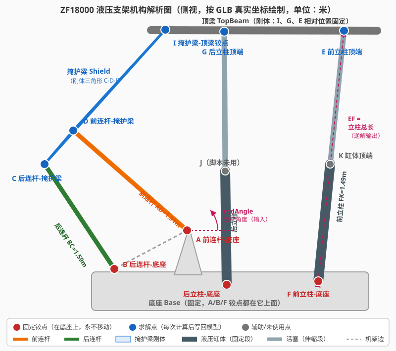
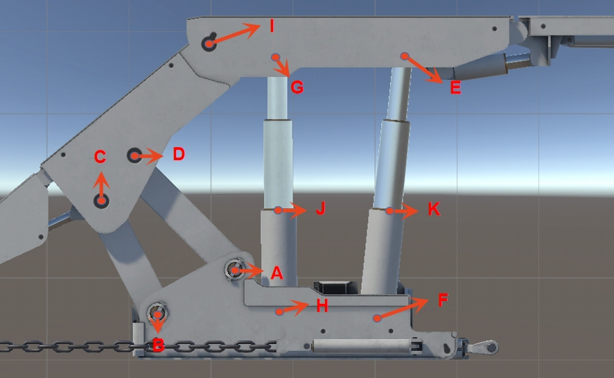
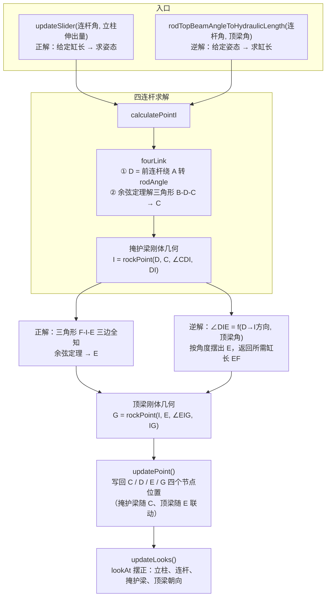

# scence.js 脚本解析文档 —— ZF18000 液压支架运动学仿真

> 关联文件：
> - 脚本：`script/isRun/scence.js`
> - 模型：`src/ZF18000-scence-action.glb`
> - 点位照片：`docs/点位.jpg`
> - 机构解析图：`docs/scence-机构解析图.svg`

---

## 一、概述

`scence.js` 是一个**液压支架（煤矿综采支架）的四连杆机构运动学求解器**。

它**不播放预制动画**（GLB 文件里没有任何动画数据），而是用纯几何/三角函数实时计算：
给定「连杆摆角」和「顶梁俯仰角」，算出支架每个铰接点应该在的位置，把坐标写回模型节点，让支架做出升架/降架动作。

一句话总结：

> **构造函数量好所有"不变的杆长和夹角"，之后每次调用用余弦定理解四连杆求出 C、D、I 点，再解立柱三角形求出 E、G 点，写回 GLB 里的 `_pos` 空节点，靠父子层级和 lookAt 让整台支架摆出正确姿态。**

---

## 二、机器的物理结构

### 2.1 构件组成

| 构件 | 英文/节点名 | 说明 |
|---|---|---|
| 底座 | Base | 贴地部分，所有固定铰点都在它上面（机架） |
| 顶梁 | TopBeam | 顶部水平大梁，实际工况中顶住煤矿顶板 |
| 掩护梁 | Shield | 左侧斜梁，连接顶梁和连杆机构，下挂尾梁 TailBeam |
| 前连杆 | frontrod | 短杆 A–D，连接底座和掩护梁 |
| 后连杆 | backrod | 短杆 B–C，连接底座和掩护梁 |
| 前立柱 | FrontColumn | 液压缸"腿"：缸体 F–K + 两级活塞，顶端铰接顶梁 E 点 |
| 后立柱 | BackColumn | 同上，顶端铰接顶梁 G 点 |

**四连杆机构** = 底座（机架边 A–B）+ 前连杆（A–D）+ 后连杆（B–C）+ 掩护梁（连架边 C–D）。
它的作用：立柱顶升顶梁时，掩护梁顶端 I 点被两根连杆约束，沿近似垂直的轨迹（双纽线轨迹）运动，保证支架升降时顶梁端部与煤壁的距离基本不变。

### 2.2 机构解析图

按 GLB 模型真实坐标绘制的侧视图（机构完全在 Y-Z 平面内运动，所有铰点 X = 0）：



原始点位照片：



### 2.3 点位对照表

| 图中字母 | 脚本变量 | GLB 节点名 | 物理含义 | 初始局部坐标 (Y, Z) 米 |
|---|---|---|---|---|
| A | `PointA` | `frontrod_fixed_pos` | 前连杆 ↔ 底座 铰点（固定） | (0.953, −0.947) |
| B | `PointB` | `backrod_fixed_pos` | 后连杆 ↔ 底座 铰点（固定） | (0.461, −1.862) |
| C | `PointC` | `backrod_shield` | 后连杆 ↔ 掩护梁 铰点（求解） | (1.787, −2.745) |
| D | `PointD` | `frontrod_shield` | 前连杆 ↔ 掩护梁 铰点（求解） | (2.212, −2.381) |
| E | `PointE` | `frontcolumn_hydraulic_slidingshaft2_pos` | 前立柱活塞顶端 ↔ 顶梁（求解） | (3.477, 1.035) |
| F | `PointF` | `frontcolumn_hydraulic_fixed_pos` | 前立柱缸体底部 ↔ 底座（固定） | (0.310, 0.708) |
| G | `PointG` | `backcolumn_hydraulic_slidingshaft2_pos` | 后立柱活塞顶端 ↔ 顶梁（求解） | (3.464, −0.479) |
| I | `PointI` | `shield_pos` | 掩护梁 ↔ 顶梁 铰点（求解，关键点） | (3.488, −1.218) |
| K | `PointK` | `frontcolumn_hydraulic_fixed_end` | 前立柱缸体顶端（辅助测量点） | (1.787, 0.859) |

> 坐标系：以 `SupportPivot` 节点为原点的局部坐标，Y 向上，Z 向前（+Z 朝煤壁侧）。X 全部为 0。
> 照片中的 **H、J 两点脚本没有使用**（J 是后立柱缸体顶端，即 K 的后立柱版本；脚本通过顶梁刚体几何从 E 推出 G，不需要后立柱长度参与计算）。

### 2.4 构造时测得的刚体常量（永不改变）

| 常量 | 含义 | 数值（米/度） |
|---|---|---|
| `LengthAD` | 前连杆长度 | ≈ 1.91 |
| `LengthBC` | 后连杆长度 | ≈ 1.59 |
| `LengthCD` | 掩护梁上 C–D 距离 | ≈ 0.56 |
| `LengthDI` | 掩护梁上 D–I 距离 | ≈ 1.73 |
| `AngleCDI` | 掩护梁刚体三角形 ∠CDI | 构造时测量 |
| `LengthIE` | 顶梁上 I–E 距离 | ≈ 2.25 |
| `LengthIG` | 顶梁上 I–G 距离 | ≈ 0.74 |
| `AngleEIG` | 顶梁刚体 ∠EIG（带符号） | 构造时测量 |
| `LengthFK` | 前立柱缸体（不伸缩段）长度 | ≈ 1.49 |
| `AngleAB_Horizontal` | A→B 连线与水平方向的夹角（角度基准） | 构造时测量 |

这些量只在构造时测一次：杆件是刚体，无论支架怎么动，刚体内部的距离和夹角都不变，**变的只是各点的位置**。

---

## 三、GLB 模型结构

### 3.1 节点树（与脚本相关的部分）

```text
SupportPivot                  ← 统一坐标基准（脚本将其旋转重置为单位四元数）
Base                          ← 底座
FrontColumn                   ← 前立柱
 ├─ frontcolumn_hydraulic_fixed_pos      (F点) ─ 缸体网格
 ├─ frontcolumn_hydraulic_fixed_end      (K点)
 └─ frontcolumn_hydraulic_slidingshaft2_pos (E点) ─ 二级活塞网格
     ├─ TopBeamDIR                       ← 顶梁朝向控制节点
     │   └─ TopBeam                      ← ★ 整个顶梁挂在 E 点下面
     └─ frontcolumn_hydraulic_slidingshaft1_pos ─ 一级活塞网格
BackColumn                    ← 后立柱（结构与前立柱相同，顶端为 G 点）
Rod                           ← 连杆组
 ├─ frontrod_fixed_pos        (A点) ─ 前连杆网格
 ├─ frontrod_shield           (D点)
 ├─ backrod_fixed_pos         (B点) ─ 后连杆网格
 └─ backrod_shield            (C点)
     └─ Shield                ← ★ 整个掩护梁（含尾梁 TailBeam）挂在 C 点下面
```

（其余 Flap1 / FrontBeam / FrontStroke / BackStroke / TailBeam 等节点是侧护板、前梁、推移千斤顶、尾梁等部件，本脚本不涉及。）

### 3.2 两个关键设计

**① "空节点当铰点"**：大量 `xxx_pos` 节点本身没有网格，是纯定位用的空节点，真正的几何体挂在它们下面。脚本移动的都是 `_pos` 节点，网格跟着父级走。

**② 父子层级承载"联动"**（理解整个脚本的钥匙）：

- `Shield`（掩护梁+尾梁）是 `backrod_shield`（C 点）的子节点 → **移动 C 点，整个掩护梁跟着动**
- `TopBeam`（顶梁）经 `TopBeamDIR` 挂在 `frontcolumn_hydraulic_slidingshaft2_pos`（E 点）下 → **移动 E 点，整个顶梁跟着动**

所以脚本只需要算出并写入 **C、D、E、G 四个点的位置** + 摆正几个朝向，整台支架就能摆出正确姿态。

---

## 四、用到的 Three.js 概念速成

| 概念 | 说明 |
|---|---|
| 场景图 | 模型是一棵树，每个节点（`Object3D`）有 `position` / `quaternion` / `scale`。**`position` 是相对父节点的局部坐标**，不是世界坐标 |
| `getObjectByName(name)` | 按名字在整棵树里查找节点 |
| `getWorldPosition(v)` | 获取节点的世界坐标 |
| `worldToLocal` / `localToWorld` | 世界坐标 ↔ 某节点局部坐标互转。比较两个点必须先统一坐标系，脚本统一用 `SupportPivot` 局部系 |
| `updateWorldMatrix(true, true)` | three.js 的变换矩阵有缓存，改完 `position` 必须手动刷新，否则读到旧值——这就是脚本里到处调用它的原因 |
| `Vector3` | 三维向量：`distanceTo` 两点距离、`angleTo` 两向量夹角（仅返回 0~180° 无符号值）、`sub` 相减、`normalize` 归一化。⚠️ **这些方法会就地修改向量本身**，所以脚本里反复 `clone()`，否则存好的点位会被算坏 |
| `Quaternion.setFromAxisAngle(轴, 弧度)` | 构造"绕某根轴旋转某角度"。本脚本只绕 X 轴（`this.Right`）转 → **所有运动都在 Y-Z 平面内，本质是 2D 平面运动学** |
| `lookAt(目标点)` | 旋转节点使其 Z 轴指向目标世界坐标，脚本用它摆正零件朝向 |
| `MathUtils` | `degToRad` / `radToDeg` 角度弧度互转，`clamp` 数值钳制 |

### 脚本运行环境（编辑器注入）

脚本开头的 `setPosition / setRotationDeg / setScale` **不是 three.js 的 API**，是本编辑器注入的。
`src/nodeScriptControl.js` 通过 `new Function('node', 'setPosition', 'setRotationDeg', 'setScale', 'deg', 'THREE', 'scene', 脚本内容)` 执行脚本，把当前挂载节点、辅助函数、THREE 库和场景传进来。开头三行的作用是把脚本所挂节点复位归零。

---

## 五、类方法详解

### 5.1 构造函数（测量"出厂参数"）

1. 把 `SupportPivot` 的旋转重置为单位四元数，作为统一坐标基准
2. 用 `getLocalPoint` 读取 A~K 各铰点的初始位置（统一转到 SupportPivot 局部系）
3. 记录上文 2.4 节的全部刚体常量
4. 缓存 4 个需要写回位置的节点引用（C、D、E、G 对应节点）

### 5.2 工具方法

| 方法 | 作用 |
|---|---|
| `getRequiredObject(name)` | `getObjectByName` + 找不到就抛错 |
| `getLocalPoint(name)` | 节点世界坐标 → SupportPivot 局部坐标 |
| `rockPoint(A, B, 角度, 长度)` | **核心几何工具**："从 A 出发，沿 A→B 方向绕 X 轴转过指定角度，走指定长度"——已知一边和夹角求三角形第三顶点 |
| `getAngle(p1, center, p2)` | 求夹角 ∠p1-center-p2（无符号） |
| `getTriangleAngle(a, b, c)` | **余弦定理**：已知三边求 a、b 的夹角。解四连杆的数学核心 |
| `localPointToWorld(p)` | SupportPivot 局部坐标 → 世界坐标 |
| `setWorldPosition(obj, p)` | 世界坐标 → 目标节点**父级**局部坐标 → 写入 `position`（three.js 的 position 必须是父级局部系的值） |
| `setLocalPointAsWorldPosition(obj, p)` | 上面两步的组合：算出的局部点直接写回节点 |
| `checkVector3` / `toNumber` | 输入校验，无效坐标/数字立即抛错 |

### 5.3 `fourLink(rodAngle)` —— 四连杆位置正解

输入：前连杆相对水平面的角度（度）。

```text
① AngleDAB = rodAngle + AngleAB_Horizontal      （换算到 A→B 边的基准）
② D = rockPoint(A, B, AngleDAB, LengthAD)        前连杆绕 A 转到位 → D 点
③ 现在 B、D 已知，C 点同时满足：
     |BC| = 后连杆长（定值）
     |CD| = 掩护梁 C-D 边长（定值）
   → 三角形 B-D-C 三边全知 → 余弦定理求 ∠DBC
④ ∠ABC = ∠DBA + ∠DBC
⑤ C = rockPoint(B, A, -∠ABC, LengthBC)           从 B 转出 C 点
```

这就是教科书式的四连杆位置解法（两圆求交，用余弦定理形式实现）。

### 5.4 `calculatePointI(rodAngle)`

C、D 解出后，掩护梁是刚体，I 相对 C、D 的位置固定：

```text
I = rockPoint(D, C, AngleCDI, LengthDI)   （沿 D→C 方向转固定角 ∠CDI，走固定距离 DI）
```

### 5.5 `updateSlider(rodAngle, frontColumn)` —— 正向运动学

**输入：连杆角度 + 前立柱液压伸出量 → 输出：顶梁姿态**

```text
① 立柱总长 EF = 伸出量 + LengthFK（缸体长）
② 解四连杆得 I 点
③ 三角形 F-I-E 三边全知（IF 可算、IE 定值、EF 给定）→ 余弦定理求 ∠FIE
④ E = rockPoint(I, F, -∠FIE, LengthIE)
⑤ G = rockPoint(I, E, AngleEIG, LengthIG)        顶梁刚体几何推出 G
⑥ updatePoint() 写回模型
```

### 5.6 `rodTopBeamAngleToHydraulicLength(rodAngle, topBeamAngle)` —— 逆向运动学

**输入：连杆角度 + 想要的顶梁俯仰角 → 输出：需要的前立柱液压缸长度**（最常用入口）

```text
① 解四连杆得 I 点
② 由 D→I 方向角 + 初始偏置 + 顶梁目标角 → 算出 ∠DIE
③ E = rockPoint(I, D, -∠DIE, LengthIE)           直接按角度摆出 E 点
④ LengthEF = |EF| ← 返回值：立柱需要的总长
⑤ G = rockPoint(I, E, AngleEIG, LengthIG)
⑥ updatePoint() + updateLooks() 写回模型
```

### 5.7 `updatePoint()` —— 写回位置

把算好的 G、E、D、C 写入对应节点。由于父子挂载（3.2 节），顶梁跟着 E 走、掩护梁跟着 C 走。

### 5.8 `updateLooks()` —— 摆正朝向

位置写完后零件还歪着，用 `lookAt` 逐个摆正：

| lookAt 调用 | 效果 |
|---|---|
| 立柱缸体 ↔ 活塞互相对视 | 液压缸始终沿 F→E（前）/ Fb→G（后）直线 |
| `frontrod_fixed_pos` → D；`backrod_fixed_pos` → C | 连杆网格绕 A、B 铰点转动到位 |
| `backrod_shield` → D 点 | 掩护梁从 C 指向 D，姿态确定 |
| `TopBeamDIR` → G 点 | E 定位置 + 看向 G 定角度 → 顶梁姿态完全确定 |

---

## 六、计算流程图



---

## 七、调用入口与步进动画（脚本末尾）

```js
window[STORE_KEY] = new HydraulicMechanism(scene)   // 单例，只创建一次
window.step = 40  /  window.step += 1               // 每运行一次脚本角度 +1°
group.rodTopBeamAngleToHydraulicLength(window.step, 0)
```

- **实例必须存在 `window` 上**，这不只是性能优化：构造函数按"模型当前姿态"测量刚体参数，如果支架已经动过再重新 `new`，量出来的常量就是错的。
- `step` 从 40° 起，每次在编辑器里运行脚本连杆角 +1°、顶梁保持水平（0°）→ **反复点运行，支架一格一格升起来**。

---

## 八、注意事项与已知细节

1. **初始姿态假设**：构造函数第 13 行强行把 `SupportPivot` 旋转归零，假设模型初始姿态标准；若加载时带旋转会被抹掉。
2. **角度符号修正**：第 67、71 行根据点的 Y 坐标高低翻转正负号——`angleTo` 只返回 0~180° 无符号角，方向需手动补。
3. **点位的可变性**：`PointC/D/E/G/I` 每次计算被覆盖；`PointA/B/F` 永远是初始值（底座固定铰点本来就不动）。
4. **必须 clone()**：`Vector3` 的 `sub/normalize/applyQuaternion` 等都是就地修改，不 clone 会污染缓存的点位数据（第 57 行注释专门提醒）。
5. **调试输出**：脚本里留有较多 `console.log`，正式使用可清理。
6. **2D 本质**：旋转轴固定为 X 轴，整个机构是平面机构；若模型出现 X 方向偏移，计算不受影响但视觉会错位。
