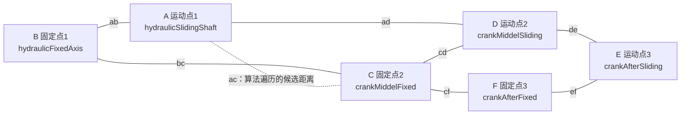

# 四连杆算法转 Three.js 点位说明

## 这份文档解决什么问题

这份文档只说明两件事：

1. `SupportTest` 里的四连杆算法，转成 Three.js 时应该怎么写。
2. 你需要在模型里提供哪些点位，才能让我把算法接到 `3dModelEditor` 里。

这里说的“四连杆”，主要参考 `D:\SupportTest` 里的 C++ 输出：

```text
D:\SupportTest\ModelManagers_BackUpThisFolder_ButDontShipItWithYourGame\il2cppOutput\SupportRuntime.cpp
```

核心类是：

```text
TwoFourLink
```

这个类的名字容易误导。它不是只需要 4 个点的普通四连杆，而是需要 6 个关键点，结构更像两段连续的四连杆。

## 你需要提供的点位

我需要你在模型里确认 6 个点，外加 1 个旋转轴方向。

建议统一叫 A、B、C、D、E、F：

```text
A：运动点 1
B：固定点 1
C：固定点 2
D：运动点 2
E：运动点 3
F：固定点 3
```

对应 C++ 里的变量名：

```text
A = hydraulicSlidingShaft
B = hydraulicFixedAxis
C = crankMiddelFixed
D = crankMiddelSliding
E = crankAfterSliding
F = crankAfterFixed
```

点位关系图：



你给我的点位最好是模型里的空节点，也就是 `Object3D`。如果现在只有 mesh，没有空节点，也可以在编辑器里建 `_pos` 点作为运动点。

## 每个点应该怎么选

### B 固定点 1

这是第一根杆的下固定轴点。

要求：

- 运动时不应该被算法移动。
- 最好位于底座、固定架或固定连杆轴上。

### A 运动点 1

这是第一根杆的上运动轴点。

要求：

- 会被算法移动。
- 和 B 之间的距离是 `ab`。
- 和 D 之间的距离是 `ad`。

### C 固定点 2

这是中间固定轴点。

要求：

- 运动时不应该被算法移动。
- 它和 B 的距离是 `bc`。
- 它和 D 的距离是 `cd`。
- 它和 F 的距离是 `cf`。

### D 运动点 2

这是中间运动轴点。

要求：

- 会被算法移动。
- 和 A、C、E 都有关联。
- 它是整套机构中最关键的中间点。

### E 运动点 3

这是后段运动轴点。

要求：

- 会被算法移动。
- 和 D 的距离是 `de`。
- 和 F 的距离是 `ef`。

### F 固定点 3

这是后段固定轴点。

要求：

- 运动时不应该被算法移动。
- 和 C 的距离是 `cf`。
- 和 E 的距离是 `ef`。

## 还需要一个旋转轴方向

C++ 里的 `RockPoint` 用的是：

```text
eulerTempTRS.right
```

意思是：所有点都围绕某个方向旋转。转成 Three.js 后，需要一个旋转轴向量。

你可以给我其中一种：

1. 一个参考节点，比如 `fourlink_axis_ref`，我用它的世界 X 方向作为旋转轴。
2. 直接告诉我旋转轴是 X、Y 还是 Z。
3. 如果你不确定，我可以先根据 A/B/C/D/E/F 的初始位置推算一个平面法线。

对 `ZF18000.glb` 来说，前面观察到这些连杆点大多在同一个侧面平面里，所以第一版很可能用 X 轴作为旋转轴。

## 算法里会记录哪些长度

初始化时不手写长度，而是从模型初始点位计算：

```text
ab = distance(B, A)
bc = distance(B, C)
cd = distance(D, C)
ad = distance(A, D)
de = distance(D, E)
ef = distance(E, F)
cf = distance(F, C)
```

这些长度后续会保持不变。算法运动时，只改变 A、D、E 这三个运动点的位置。

## 算法里会记录哪些角度

初始化时还会记录：

```text
ADE：A、D、E 三个运动点形成的初始夹角
BCF：B、C、F 三个固定点形成的初始夹角补角
```

它们用于后面的角度反算。

## Three.js 版本的整体流程

Three.js 里会按这个流程写：

```text
1. 读取 A/B/C/D/E/F 六个节点
2. 读取它们的世界坐标
3. 计算 ab、bc、cd、ad、de、ef、cf
4. 计算 ADE、BCF
5. 根据目标值遍历 ac
6. 对每个 ac 调用 solveFourLink
7. 找到误差最接近 0 的结果
8. 根据结果算出 A、D、E 的新位置
9. 把世界坐标转成本地坐标，写回 Three.js 节点
```

这里的 `ac` 是 A 到 C 的距离。C++ 里会遍历这个距离，用它反推出整套机构的角度。

## 核心公式

主要使用余弦定理：

```text
angle = acos((a² + b² - c²) / (2ab))
```

第一段角度：

```text
angABC = acos((ab² + bc² - ac²) / (2 * ab * bc))
```

中间辅助角：

```text
tempABC = acos((ac² + bc² - ab²) / (2 * ac * bc))
tempACD = acos((ac² + cd² - ad²) / (2 * ac * cd))
angADC  = acos((ad² + cd² - ac²) / (2 * ad * cd))
```

后段距离：

```text
angleCDE = ADE - angADC
dce = sqrt(cd² + de² - 2 * cd * de * cos(angleCDE))
```

后段角度：

```text
tempDCE = acos((cd² + dce² - de²) / (2 * cd * dce))
tempDCF = acos((dce² + cf² - ef²) / (2 * cf * dce))

angDCF = tempDCE + tempDCF
angCFE = acos((cf² + ef² - dce²) / (2 * cf * ef))
```

误差：

```text
error = BCF - (tempABC + tempACD) - (tempDCE + tempDCF)
```

当 `error` 接近 0 时，说明当前 `ac` 找到了一个比较合理的位置。

## 怎么找可用解

C++ 的做法是遍历 `ac`：

```text
从 startAC 到 endAC
  每隔 step 取一个 ac
  调用 solveFourLink(ac)
  记录误差
找到误差最接近 0 的区间
缩小 step 继续找
```

Three.js 版本也会这么写。

第一版可以先用简单参数：

```text
startAC = 0
endAC   = ab * 2
step    = 0.02 或按模型尺寸调整
```

如果需要更精细，再缩小步长。

## 怎么更新点位

C++ 的 `RockPoint` 逻辑是：

```text
dir = normalize(B - A)
rotated = rotate(dir, angle, axis)
target = A + rotated * length
```

为了避免和 A/B/C/D/E/F 名字冲突，可以理解成：

```text
RockPoint(startPoint, lookPoint, targetPoint, angle, length)
```

Three.js 写法：

```js
const dir = lookWorld.clone().sub(startWorld).normalize();
const q = new THREE.Quaternion().setFromAxisAngle(axis, THREE.MathUtils.degToRad(angle));
const rotated = dir.clone().applyQuaternion(q).normalize();
const targetWorld = startWorld.clone().add(rotated.multiplyScalar(length));
```

最终写回三个运动点：

```text
A = RockPoint(B, C,  angABC,  ab)
D = RockPoint(C, F,  angDCF,  cd)
E = RockPoint(F, C, -angCFE,  ef)
```

## 写到 Three.js 节点时要注意什么

Three.js 节点通常有父级，所以不能直接把世界坐标塞给 `position`。

需要先把世界坐标转成父级本地坐标：

```js
function setWorldPosition(object, targetWorld) {
  const local = targetWorld.clone();
  object.parent.updateWorldMatrix(true, true);
  object.parent.worldToLocal(local);
  object.position.copy(local);
  object.updateMatrix();
  object.updateWorldMatrix(true, true);
}
```

这点和前后立柱升降算法一样。

## 你给点位时建议用这个表

你可以直接按这个表给我：

```text
B 固定点1：
A 运动点1：
C 固定点2：
D 运动点2：
F 固定点3：
E 运动点3：
旋转轴方向：
```

如果对应到 `ZF18000.glb`，目前已看到的候选点有：

```text
frontrod_fixed
frontrod_shield
backrod_fixed
backrod_shield
topbeam
topbeamcentertop
shield
```

但这些还不能直接确认完整六点映射，需要你结合模型含义确认。

## 如果你只能提供 4 个点

如果当前模型只有普通四连杆的 4 个点，也可以先提供：

```text
下固定点 1
上运动点 1
下固定点 2
上运动点 2
```

这种可以先做普通四连杆验证，但它不是完整的 `TwoFourLink`。如果要按 C++ 里的算法完整复现，仍然建议补齐 A/B/C/D/E/F 六点。

## 我拿到点位后会怎么做

拿到点位后，实现会分三步：

1. 写通用四连杆算法模块。
2. 写可粘贴到脚本编辑器里的验证脚本。
3. 在 `3dModelEditor` 里接调试滑条，先单独驱动四连杆。

确认方向和点位都正确后，再考虑和前后立柱高度联动。
