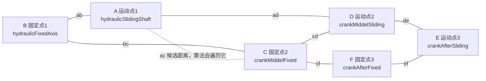

# ZF18000 四连杆算法从 C++ 转 Three.js 设计

## 目标

本设计只做一件事：把 `D:\SupportTest` 里 C++ 输出中的四连杆算法整理清楚，并规划成 `D:\3dModelEditor` 可以使用的 Three.js 版本。你确认后，再开始写 JS 实现。

本次先不改代码。

## C++ 算法来源

核心代码在：

```text
D:\SupportTest\ModelManagers_BackUpThisFolder_ButDontShipItWithYourGame\il2cppOutput\SupportRuntime.cpp
```

重点函数和结构：

- `TwoFourLink` 结构体：约在 `SupportRuntime.cpp:1406`
- `TwoFourLink_AwakeInit`：约在 `SupportRuntime.cpp:7204`
- `TwoFourLink_StartIterator`：约在 `SupportRuntime.cpp:7388`
- `TwoFourLink_IteratorBC`：约在 `SupportRuntime.cpp:7400`
- `TwoFourLink_Solve`：约在 `SupportRuntime.cpp:7672`
- `TwoFourLink_UpdataSlider`：约在 `SupportRuntime.cpp:7828`
- `TwoFourLink_RockPoint`：约在 `SupportRuntime.cpp:7853`
- `MathTools_Angle`：约在 `SupportRuntime.cpp:3048`

另一个文件里也有派生和测试类：

```text
D:\SupportTest\ModelManagers_BackUpThisFolder_ButDontShipItWithYourGame\il2cppOutput\Assembly-CSharp.cpp
```

其中 `TBFourLink1`、`VerticalRodPart1`、`FourLinkDetermineLength1` 可以作为参考，但第一版建议以 `SupportRuntime.cpp` 里的 `TwoFourLink` 为主。这个类更接近通用四连杆/双四连杆计算。

## C++ 里的点位含义

`TwoFourLink` 不是简单四个点，而是六个关键点：

```text
hydraulicFixedAxis       固定点 1
hydraulicSlidingShaft    运动点 1
crankMiddelFixed         固定点 2
crankMiddelSliding       运动点 2
crankAfterFixed          固定点 3
crankAfterSliding        运动点 3
```

为了后面沟通点位，建议把它们统一记成 A 到 F：

```text
A = hydraulicSlidingShaft    运动点 1
B = hydraulicFixedAxis       固定点 1
C = crankMiddelFixed         固定点 2
D = crankMiddelSliding       运动点 2
E = crankAfterSliding        运动点 3
F = crankAfterFixed          固定点 3
```

点位关系图：



你需要给我的点位就是这 6 个点，外加一个旋转轴方向：

```text
B 固定点1
A 运动点1
C 固定点2
D 运动点2
F 固定点3
E 运动点3
旋转轴方向，通常是模型侧面法线，ZF18000 初步看像 X 轴方向
```

如果只给 4 个点，也可以先做普通四连杆验证；但要完整复刻 C++ 里的 `TwoFourLink`，最好给齐 6 个点。

它保存的杆长有：

```text
ab  = B 到 A
bc  = B 到 C
cd  = D 到 C
ad  = A 到 D
de  = D 到 E
ef  = E 到 F
cf  = F 到 C
```

它保存的角度有：

```text
ADE      初始运动点 1、运动点 2、运动点 3 的夹角
BCF      固定点 1、固定点 2、固定点 3 的补角
angABC   解算出的第一段角度
angDCF   解算出的第二段角度
angCFE   解算出的第三段角度
angADC   中间角度
```

这说明 C++ 里的 `TwoFourLink` 实际上更像“连续两组四连杆”的解算器，不只是普通四边形。

## 初始化逻辑

C++ 的 `TwoFourLink_AwakeInit` 会从模型初始姿态读取所有长度和角度。

Three.js 版本也应该这样做，不手写杆长：

1. 从模型节点读取六个点。
2. 调用 `getWorldPosition()` 取世界坐标。
3. 计算所有杆长。
4. 计算初始角度 `ADE` 和 `BCF`。
5. 记录初始位置，后续重置时使用。

Three.js 里对应函数可以叫：

```js
createFourLinkState(root, nodeNames, options)
```

它返回：

```js
{
  ok: true,
  state: {
    nodes,
    lengths,
    angles,
    axis,
    initialWorld
  }
}
```

## 核心解算流程

C++ 的流程是：

1. 从 `startAC` 到 `endAC` 遍历候选值。
2. 每个候选值调用 `Solve(ac)`。
3. `Solve(ac)` 返回一个误差。
4. 找到正负误差之间最接近 0 的区间。
5. 缩小步长继续递归查找。
6. 误差小于 `DNL` 后，认为解算成功。
7. 调用 `UpdataSlider()` 写回运动点。

Three.js 版本可以保持这个思路，但写得更直接：

```text
solveFourLink(state, ac)
  -> 根据余弦定理算角度
  -> 返回误差和三个角度

findBestFourLinkSolution(state)
  -> 遍历 ac
  -> 找误差最小的结果
  -> 必要时缩小区间继续找

applyFourLinkSolution(state, solution)
  -> 用 RockPoint 算三个运动点
  -> 写回 Three.js 节点位置
```

## `Solve(ac)` 的数学公式

C++ 里主要用余弦定理：

```text
angle = acos((a² + b² - c²) / (2ab))
```

对应关系整理如下。

第一段：

```text
angABC = acos((ab² + bc² - ac²) / (2 * ab * bc))
```

中间辅助角：

```text
tempABC = acos((ac² + bc² - ab²) / (2 * ac * bc))
tempACD = acos((ac² + cd² - ad²) / (2 * ac * cd))
angADC  = acos((ad² + cd² - ac²) / (2 * ad * cd))
```

后段：

```text
angleCDE = ADE - angADC
dce = sqrt(cd² + de² - 2 * cd * de * cos(angleCDE))

tempDCE = acos((cd² + dce² - de²) / (2 * cd * dce))
tempDCF = acos((dce² + cf² - ef²) / (2 * cf * dce))

angDCF = tempDCE + tempDCF
angCFE = acos((cf² + ef² - dce²) / (2 * cf * ef))
```

最后误差：

```text
error = BCF - (tempABC + tempACD) - (tempDCE + tempDCF)
```

如果 `error` 越接近 0，说明当前 `ac` 对应的几何关系越接近可用解。

## `RockPoint` 的转写方式

C++ 的 `RockPoint(A, B, target, angle, length)` 逻辑是：

```text
dir = normalize(B.position - A.position)
rotated = Quaternion.AngleAxis(angle, eulerTempTRS.right) * dir
target.position = A.position + normalize(rotated) * length
```

Three.js 里对应写法：

```js
const dir = bWorld.clone().sub(aWorld).normalize();
const quaternion = new THREE.Quaternion().setFromAxisAngle(axis, degToRad(angle));
const rotated = dir.clone().applyQuaternion(quaternion).normalize();
const targetWorld = aWorld.clone().add(rotated.multiplyScalar(length));
setWorldPosition(targetNode, targetWorld);
```

这里最重要的是 `axis`。C++ 用的是 `eulerTempTRS.right`，也就是 Unity 里某个参考物体的右方向。

Three.js 第一版建议这样处理：

1. 如果模型里能找到指定参考节点，就用它的世界 X 方向。
2. 如果找不到，就根据初始六点所在平面推算旋转轴。
3. 对 `ZF18000.glb`，这些连杆点基本落在同一个侧面平面内，初步看旋转轴大概率是模型的 X 轴方向。

这一点实现前需要确认，否则角度方向可能反。

## 写回运动点

C++ 的 `UpdataSlider()` 会写三个运动点：

```text
A = RockPoint(B, C,  angABC,  ab)
D = RockPoint(C, F,  angDCF,  cd)
E = RockPoint(F, C, -angCFE,  ef)
```

Three.js 里需要用世界坐标写回本地坐标，和立柱算法一样：

```js
function setWorldPosition(object, targetWorld) {
  const local = targetWorld.clone();
  object.parent.updateWorldMatrix(true, true);
  object.parent.worldToLocal(local);
  object.position.copy(local);
  object.updateMatrix();
  object.updateWorldMatrix(true, true);
}
```

如果运动点是 `_pos` 空节点，还需要考虑同名 mesh 是否也要跟随移动。立柱模块里已经做过类似处理，四连杆可以复用这个思路。

## 在 ZF18000 上的点位问题

目前 `ZF18000.glb` 里已经明确看到这些连杆相关节点：

```text
frontrod_fixed
frontrod_shield
backrod_fixed
backrod_shield
shield
topbeam
topbeamcentertop
```

这几个节点能支持普通四连杆的第一步验证：

```text
frontrod_fixed  -> 前连杆下固定点
frontrod_shield -> 前连杆上运动点
backrod_fixed   -> 后连杆下固定点
backrod_shield  -> 后连杆上运动点
```

但是 `TwoFourLink` 需要六个点，当前模型里还需要确认：

```text
crankAfterFixed
crankAfterSliding
```

它们可能对应顶梁、掩护梁上的某两个轴点，也可能需要在编辑器里新增 `_pos` 参考点。

所以实现建议分两步：

1. 先做通用 `TwoFourLink` JS 算法模块，保持六点接口。
2. 再给 `ZF18000` 做点位配置，确认六个点实际对应哪些节点。

这样不会因为点位不确定而把算法写死。

## 准备放到 3dModelEditor 的文件

建议新增：

```text
D:\3dModelEditor\src\zf18000FourLinkMotion.js
D:\3dModelEditor\src\zf18000FourLinkMotion.test.js
D:\3dModelEditor\script\ZF18000FourLink\run.js
```

职责划分：

- `zf18000FourLinkMotion.js`
  - 放正式算法。
  - 不依赖 Vue。
  - 只接收 Three.js 的 `root`、节点名配置和进度/目标值。

- `zf18000FourLinkMotion.test.js`
  - 用 `Object3D` 搭一个简化六点结构。
  - 测 `Solve`、`RockPoint`、写回点位和异常输入。

- `script/ZF18000FourLink/run.js`
  - 提供一份可粘贴进脚本编辑器的验证脚本。
  - 方便在正式接 UI 前先跑通模型动作。

## 计划中的 JS API

建议第一版导出这些函数：

```js
createFourLinkState(root, nodeNames, options)
solveFourLink(state, ac)
findFourLinkSolution(state, options)
applyFourLinkSolution(root, state, solution)
resetFourLink(root, state)
```

其中 `nodeNames` 类似：

```js
{
  hydraulicFixedAxis: '...',
  hydraulicSlidingShaft: '...',
  crankMiddelFixed: '...',
  crankMiddelSliding: '...',
  crankAfterFixed: '...',
  crankAfterSliding: '...',
  axisReference: '...' // 可选
}
```

第一版不需要做很复杂的类，普通函数就够。

## 和立柱升降的关系

立柱升降已经可以工作后，四连杆有两种接入方式：

1. 单独滑条驱动四连杆。
2. 跟随立柱高度进度驱动四连杆。

我建议第一版先用单独滑条验证四连杆，确认方向和点位正确后，再和立柱高度联动。

原因是四连杆有旋转轴方向和点位对应问题，如果直接和立柱混在一起，调试会更难。

## 错误处理

实现时需要处理：

- 缺少六个关键节点。
- 两个点重合，无法计算方向。
- 三角形不成立，`acos` 入参超出 `-1 ~ 1`。
- 找不到可用解。
- 运动点没有父节点，无法写回本地坐标。
- 旋转轴长度为 0。

遇到这些情况时，不移动模型，返回明确错误信息。

## 测试重点

测试不加载真实 GLB，只用 `Object3D` 搭一个简化结构。

需要覆盖：

- 初始化能正确读取六点和杆长。
- `Solve(ac)` 能算出有限角度。
- `RockPoint` 在 X 轴旋转平面内能算出预期点。
- `findFourLinkSolution` 能找到误差较小的解。
- `applyFourLinkSolution` 能写回三个运动点。
- 缺节点、非法三角形、无父节点时返回错误。

## 需要你确认的内容

开始实现前，最需要确认的是点位映射：

```text
hydraulicFixedAxis
hydraulicSlidingShaft
crankMiddelFixed
crankMiddelSliding
crankAfterFixed
crankAfterSliding
```

如果你能接受，我会先把 JS 算法做成通用六点版本，并在 `ZF18000` 上先用现有 `frontrod/backrod/shield/topbeam` 节点做验证。如果发现缺少两个轴点，就在编辑器里通过 `_pos` 方式补参考点，再继续联动。
